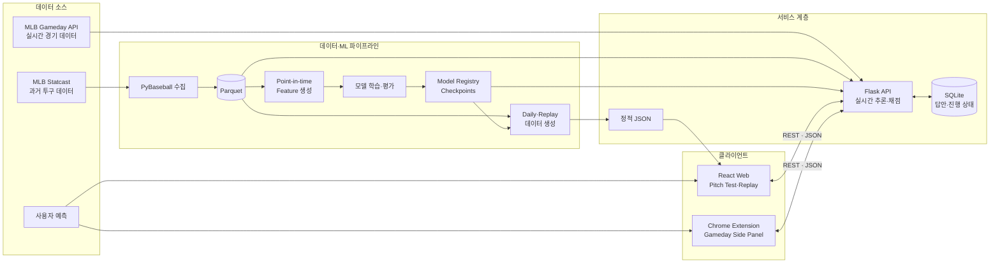

# ⚾ OyarZabal

MLB 경기의 다음 투구 구종을 예측하고, 사람과 AI의 판단을 실제 결과와
비교하는 야구 예측 프로젝트입니다.

[Pitch Test Web](https://www.pitchtest.madcamp-kaist.org/) ·
[프로젝트 소개](https://app.notion.com/p/OyarZabal-3ad58be2d6ec80b49a48c29d9b83b770)

## 프로젝트 소개

OyarZabal은 과거 투구 기록과 현재 경기 상황을 분석해 다음 구종의 확률을
예측합니다. 사용자는 완료된 경기를 한 구씩 재생하거나 오늘의 Pitch Test와
명승부 세트에 참여하면서 모델의 예측 과정을 직접 확인할 수 있습니다.

MLB Gameday Chrome Extension을 이용하면 진행 중인 경기에서도 사람과 AI가
같은 조건으로 다음 구종을 예측할 수 있습니다. 모든 모델 입력에는 목표 투구
이전에 알 수 있는 정보만 사용해 데이터 누출 없는 평가를 지향합니다.

## 주요 기능

### 1. 실시간 사람 vs AI 구종 예측

MLB Gameday 경기 화면 옆에서 사용자와 AI가 다음 구종을 실시간으로
예측합니다.

- MLB live feed에서 투수, 타자, 볼카운트, 주자와 직전 투구 정보를 읽습니다.
- 다음 투구 상황이 확정되면 8초 동안 구종 계열과 세부 구종을 선택합니다.
- 사용자의 답안이 잠기기 전까지 모델 예측을 숨깁니다.
- 모델 계산 중 경기 상황이 바뀌면 오래된 결과를 폐기하고 다시 예측합니다.
- 세부 구종 적중은 3점, 같은 계열 적중은 1점으로 채점합니다.

### 2. 투구 단위 경기 리플레이

완료된 MLB 경기를 한 구씩 다시 진행하며 실제 경기 흐름 속에서 모델의
예측을 확인합니다.

- 이닝, 볼카운트, 투수, 타자와 주자 상황을 실제 투구 순서대로 복원합니다.
- 사용자가 예측을 완료하기 전까지 실제 구종과 모델의 선택을 숨깁니다.
- 3개 구종 계열과 6개 세부 구종의 예측 확률을 함께 표시합니다.
- 결과를 `세부 구종 적중`, `같은 계열 적중`, `다른 계열`로 구분합니다.
- 과거 명승부의 주요 타석을 선별한 별도 세트도 제공합니다.

### 3. 데일리 Pitch Test

매일 새로운 MLB 투구 장면으로 사람과 AI의 예측 실력을 비교하는 일일
챌린지입니다.

- 전날 MLB 경기에서 영상이 준비된 3~6구 타석 세 개를 자동으로 선정합니다.
- 모델 예측은 문제 생성 시 미리 계산하고 사용자의 답안 제출 뒤 공개합니다.
- 참가자의 답안, 진행 상황과 누적 점수를 저장합니다.
- 동일한 문제를 기준으로 사람과 AI의 세부 구종·계열 적중률을 비교합니다.

## 기술 스택

| 구분 | 기술 스택 | 역할 |
|---|---|---|
| AI·머신러닝 | Python, Scikit-learn, XGBoost, PyTorch | 다음 구종 모델 학습·평가와 Sequence 모델 추론 |
| 데이터 분석 | Pandas, NumPy, SciPy | 투구 기록 정제, 시점 기반 Feature와 확률 계산 |
| 데이터 수집·저장 | PyBaseball, MLB Statcast, PyArrow, Parquet | MLB 데이터 수집과 대규모 열 기반 데이터 저장 |
| 백엔드 | Flask, Gunicorn, SQLite | 실시간 추론, 사용자 참여 API와 진행 기록 저장 |
| 프론트엔드 | React, TypeScript, Vite | Pitch Test, 리플레이와 예측 결과 시각화 |
| 브라우저 확장 | Chrome Extension, JavaScript | MLB Gameday Side Panel 실시간 예측 |
| 테스트·품질 관리 | Pytest, Vitest, Testing Library, Ruff | Python·React 동작 검증과 정적 검사 |
| 개발 환경 | uv, npm | Python·프론트엔드 의존성과 실행 명령 관리 |

## 시스템 아키텍처



과거 Statcast 데이터는 모델 학습과 정적 리플레이 생성에 사용합니다. 실시간
서비스에서는 MLB Gameday 문맥과 학습된 모델을 Flask API에서 결합하고,
React Web과 Chrome Extension에 JSON으로 전달합니다.

## 투구 예측 모델

### 계층형 구종 분류

```text
전체 투구
├── 패스트볼 계열
│   ├── 포심
│   └── 무빙 패스트볼
├── 브레이킹볼 계열
│   ├── 슬라이더 계열
│   └── 커브 계열
└── 오프스피드 계열
    ├── 체인지업
    └── 스플리터·포크
```

최종 예측은 세부 구종 확률을 계열별로 합산한 뒤 가장 높은 계열을 선택하고,
그 계열 안에서 확률이 가장 높은 세부 구종을 선택합니다.

### 모델 구성

1. **Global XGBoost**는 경기 상황과 투수 레퍼토리에서 MLB 전체의 공통
   패턴을 학습해 6개 구종의 기본 확률을 만듭니다.
2. **Pooled Residual Personalizer**는 Global 모델이 특정 투수와 상황에서
   반복적으로 만드는 오차만 제한적으로 보정합니다.
3. **Registry**는 투수를 `full`, `limited`, `shadow`로 분류해 허용할 보정
   강도를 관리합니다.
4. **Context Gate**는 매 투구의 문맥과 신뢰도를 확인하고, 안전 조건을
   충족하지 못하면 Global 예측으로 돌아갑니다.

### 주요 모델 변천사

| 버전 | 주요 변화 | 상태 |
|---|---|---|
| **V1** | MLB 전체 데이터를 학습한 Global XGBoost 구축 | 초기 기준선 |
| **V3** | 현재의 6개 세부 구종·3개 상위 계열로 개편 | Taxonomy 기준선 |
| **V4** | Global 예측에 Pooled Residual 개인화 적용 | 개인화 구조 도입 |
| **V7.2** | 계층형 Decoder, Registry, Reliability·Context Gate 적용 | 리플레이·실시간 Active |
| **V8.4** | 분포 안전 Objective와 3-seed Ensemble을 적용한 Sequence 모델 | 연구 기준선·Daily 고정 예측 |
| **V9-A** | 최근 20구 구종 비율과 마지막 사용 간격을 반영한 Game-State Expert | 연구 통과·Shadow-only |

V7.2는 빠른 실시간 추론과 현재 제품 라우팅에 사용합니다. V8.4는 Daily Pitch
Test의 고정 예측과 Sequence 연구 기준선이며, V9-A는 안전성 검증을 통과했지만
실용적 승격 기준을 충족하지 않아 제품 라우팅에는 적용하지 않습니다.

### 모델 성능

2025년 11월 1일까지 학습한 모델을 2026년 3월 25일~7월 27일의 동일한
467,300구에 적용한 historical retrospective 결과입니다.

| 모델 | Exact | Family | Hierarchical | Macro F1 | Log Loss ↓ | TVD ↓ |
|---|---:|---:|---:|---:|---:|---:|
| **V7.2 Faster** | 47.96% | 58.73% | 53.34% | **45.78%** | 1.13575 | 9.83% |
| **V9-A High-End** | **48.07%** | **58.91%** | **53.49%** | 45.62% | **1.13406** | **9.35%** |

- **Exact:** 정확한 세부 구종 적중률
- **Family:** 패스트볼·브레이킹볼·오프스피드 계열 적중률
- **Hierarchical:** 세부 구종 적중 1점, 계열만 적중 0.5점
- **Macro F1:** 6개 구종을 동일한 중요도로 평가
- **Log Loss:** 정답에 부여한 확률의 품질. 낮을수록 좋음
- **TVD:** 예측 구종 분포와 실제 분포의 거리. 낮을수록 좋음

이 평가는 이미 관찰된 historical 구간의 회귀 진단이며 독립적인 모델 승격
근거로 사용하지 않습니다.

## 프로젝트 구조

```text
ml/          데이터·Feature·모델·평가·API
web/         React + TypeScript Pitch Test·Replay
extension/   MLB Gameday Chrome Extension
config/      동결된 모델·평가 설정
docs/        제품 결정, 배포와 실험 기록
reports/     모델 버전별 성능 리포트
deploy/      systemd·Nginx 배포 설정
artifacts/   실행별 설정·지표·자원 기록
```

## 로컬 실행

### 요구 사항

- Python 3.12
- [uv](https://docs.astral.sh/uv/)
- Node.js와 npm

### Web

```bash
uv sync --extra dev
cd web
npm install
npm run dev
```

### Gameday Live API와 Chrome Extension

```bash
uv sync --extra sequence
uv run python -m oyarzabal.live_api
```

1. Chrome에서 `chrome://extensions`를 엽니다.
2. `개발자 모드`를 켭니다.
3. `압축해제된 확장 프로그램을 로드합니다`를 누릅니다.
4. 이 저장소의 `extension` 디렉터리를 선택합니다.
5. MLB Gameday 경기 페이지에서 OyarZabal Side Panel을 엽니다.

자세한 설정은 [Gameday Live Extension 문서](docs/LIVE_EXTENSION.md)를
참고하세요.

### 데이터·모델 파이프라인

```bash
uv run oyarzabal-fetch-statcast
uv run oyarzabal-train-hybrid \
  --models models/v7.2 \
  --tuning-manifest config/v7-residual-tuning.json
uv run oyarzabal-evaluate-holdout \
  --models models/v7.2 \
  --reference-models models/hybrid
uv run oyarzabal-build-demo \
  --history data/raw/statcast \
  --game /path/to/game.parquet \
  --predictions /path/to/predictions.csv
uv run oyarzabal-generate-daily
```

원본 Statcast는 월별 Parquet, 학습 모델은 `models/`, 웹용 정적 데이터는
`web/public/data`, 실행 기록은 `artifacts/runs/<run-id>`에 저장합니다.

## 검증

```bash
uv run pytest -q
uv run ruff check .

cd web
npm test
npm run build
```

Chrome Extension의 독립 JavaScript 검증:

```bash
node --test extension/*.test.cjs
node --check extension/service-worker.js
node --check extension/sidepanel.js
```

상세 모델 설계는 [프로젝트 계획](docs/PROJECT_PLAN.md), 모델별 결과는
[성능 리포트](reports/README.md), 서비스 배포는
[Human Benchmark 배포 문서](docs/HUMAN_BENCHMARK_DEPLOY.md)를 참고하세요.
