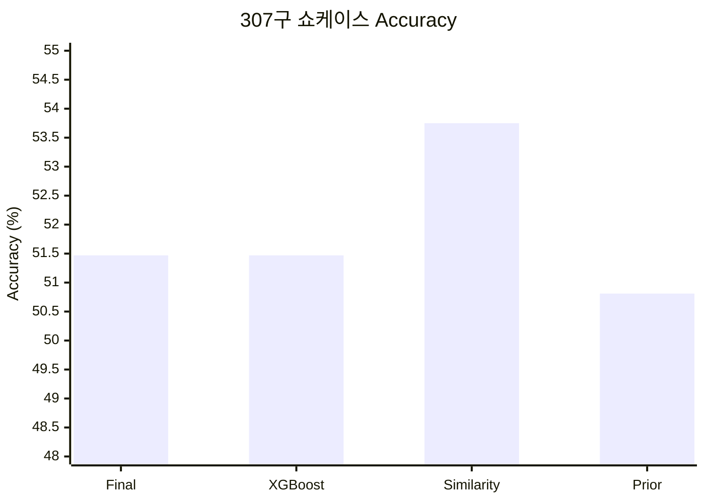

# V1 — 첫 MLB-wide Global + Specialist

## 1. 스냅샷

- 날짜: 2026-07-24
- 학습 데이터: 2022–2025 지원 구종 2,916,065구
- taxonomy: 포심, 싱커, 커터, 슬라이더, 커브, 체인지업
- 구조: 선수 ID 비의존 Global XGBoost + 검증 통과 Specialist blend
- Global: 650 trees, temperature 0.9865

## 2. 변경 사항

13명 캐시 모델에서 벗어나 MLB 전체 월별 Statcast를 사용했다. Global에서는
투수·타자 ID를 제거하고, 파일럿 5명만 독립 Specialist 후보로 평가했다. 문자열
선수 ID와 정수 registry ID가 달라 Specialist 표본이 0으로 보이던 오류와
`score_diff` 결측 오류도 이 단계에서 수정했다.

## 3. 평가 프로토콜

- 주 평가: 2024·2025 시간순 OOF 연결 결과
- 표본: 1,443,642구
- 보조 평가: 2024 월드시리즈 1차전 307구 역사적 쇼케이스
- 쇼케이스는 제품 흐름 확인용이며 독립 holdout이 아니다.

## 4. 결과

### MLB-wide OOF

| Accuracy | Top-3 Accuracy | Macro F1 | Log Loss |
|---:|---:|---:|---:|
| 47.39% | 91.66% | 45.94% | 1.1436 |

파일럿 5명 중 MLB-wide OOF 배포 게이트를 통과한 Specialist는 0명이었다.

### 307구 쇼케이스

| 모델 | Accuracy | Top-3 | Macro F1 | Log Loss |
|---|---:|---:|---:|---:|
| Final | 51.47% | 92.51% | 47.11% | 1.0841 |
| XGBoost | 51.47% | 93.16% | 48.27% | 1.0796 |
| Similarity | 53.75% | 93.16% | 37.64% | 1.0732 |
| 단순 prior | 50.81% | 90.55% | 34.14% | 1.2524 |

Similarity의 Accuracy는 높았지만 포심 예측 비율이 73.94%였고 커터·커브
recall이 0이었다. Accuracy만으로 모델을 선택하면 쏠림 모델을 고를 수 있음을
확인했다.

## 5. 해석

첫 MLB-wide 기준선을 확보했고 모든 6개 클래스에서 0보다 큰 recall을
기록했다. 반면 독립 Specialist는 Global보다 Log Loss와 Macro F1을 동시에
개선하지 못해, 선수별 완전 독립 모델이 데이터 효율 면에서 부적합하다는
근거가 됐다.

## 6. 한계

- 주 평가는 2024·2025를 연결한 값이라 특정 한 시즌의 외부 성능이 아니다.
- 쇼케이스 307구는 단일 경기이며 모델 선택에 사용할 수 없다.
- 이후 taxonomy에서 싱커와 커터가 무빙 패스트볼로 합쳐져 V3 이후와 직접
  비교할 수 없다.

## 7. 근거

- 로컬 run artifact:
  `artifacts/runs/20260724T095009353140Z/result.json`
- Git artifact: revision `096d2a1`, `web/public/data/games/775300.json`
- [실험 로그](../docs/EXPERIMENT_LOG.md)
