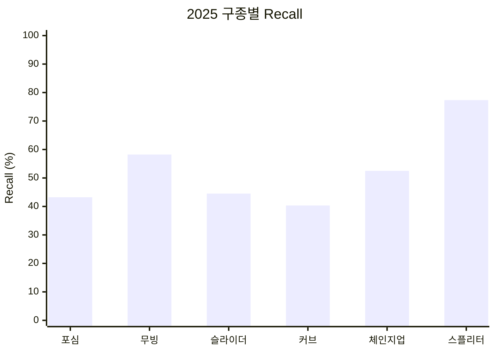

# V3 — 현재 6종 taxonomy와 Global 재학습

## 1. 스냅샷

- 날짜: 2026-07-25
- 학습 데이터: 2022–2025 지원 구종 2,990,491구
- taxonomy: 포심, 무빙 패스트볼, 슬라이더 계열, 커브 계열, 체인지업,
  스플리터/포크
- 구조: MLB-wide Global XGBoost + 검증형 personalizer
- Global: `global-sqrt-d6-m8`, 1,898 trees, temperature 1.0465

## 2. 변경 사항

싱커·투심·커터를 무빙 패스트볼로 합치고 스플리터·포크를 정식 target으로
추가했다. 슬라이더와 커브의 변형 구종도 각 계열로 통합했다. 클래스 의미와
순서가 바뀌었으므로 기존 모델을 재사용하지 않고 전체 재학습했다.

## 3. 평가 프로토콜

- 후보 선택: 2024
- 최종 게이트: 2025
- 2025 평가 표본: 750,581구
- 보조 평가: 307구 역사적 쇼케이스

## 4. 결과

### 2025 MLB-wide

| Accuracy | Top-3 Accuracy | Macro F1 | Log Loss |
|---:|---:|---:|---:|
| 48.87% | 93.08% | 47.24% | 1.1103 |

| 구종군 | Precision | Recall | F1 | Support |
|---|---:|---:|---:|---:|
| 포심 | 57.57% | 43.23% | 49.38% | 240,156 |
| 무빙 패스트볼 | 56.47% | 58.23% | 57.34% | 173,550 |
| 슬라이더 계열 | 49.13% | 44.52% | 46.71% | 169,773 |
| 커브 계열 | 35.56% | 40.33% | 37.79% | 64,112 |
| 체인지업 | 37.48% | 52.50% | 43.74% | 77,084 |
| 스플리터/포크 | 35.30% | 77.34% | 48.47% | 25,906 |

6개 클래스 모두 recall이 0보다 컸다. 파일럿 personalizer 활성 선수는
0명이었다.

### 307구 쇼케이스

| Accuracy | Top-3 | Macro F1 | Log Loss |
|---:|---:|---:|---:|
| 53.75% | 95.44% | 46.10% | 1.0012 |

해당 경기에는 스플리터·포크 실제 표본이 0구다.

## 5. 해석

현재 제품 taxonomy의 첫 안정 기준선이다. 2025 Accuracy와 Log Loss는 이전
기록보다 좋아졌지만 label 통합 효과가 섞였으므로 순수 모델 개선량으로
해석하지 않는다. Global의 최다 예측 클래스 비율은 실제 최다 클래스보다
높지 않아 전역 포심 과대예측 문제는 이 단계에서 해소됐다.

## 6. 한계

- V2와 taxonomy가 달라 직접적인 전후 비교가 불가능하다.
- 스플리터/포크는 표본이 작고 recall은 높지만 precision이 35.30%로 낮다.
- 투수별 personalizer는 여전히 활성화되지 않아 유명 선수 특화 목표를
  충족하지 못했다.

## 7. 근거

- 로컬 run artifact:
  `artifacts/runs/20260725T100422056101Z/result.json`
- Git artifact: revision `81d6009`,
  `web/public/data/games/775300.json`
- [실험 로그](../docs/EXPERIMENT_LOG.md)
