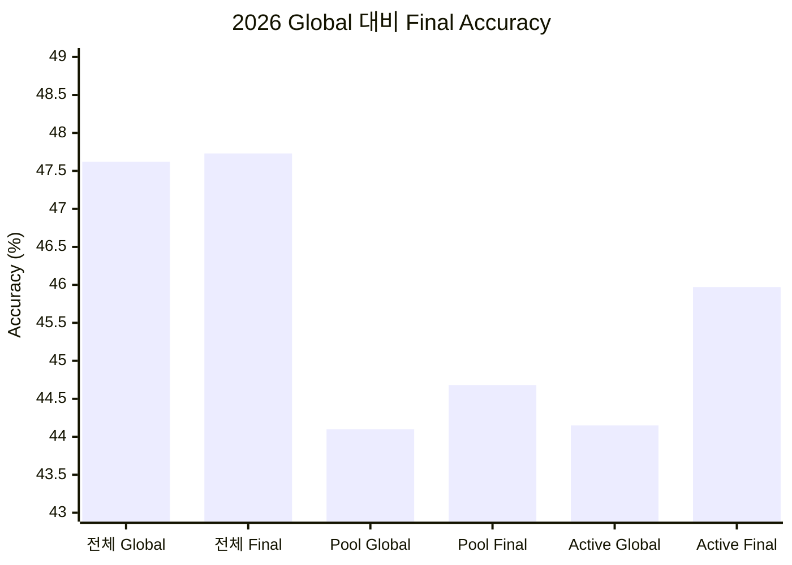
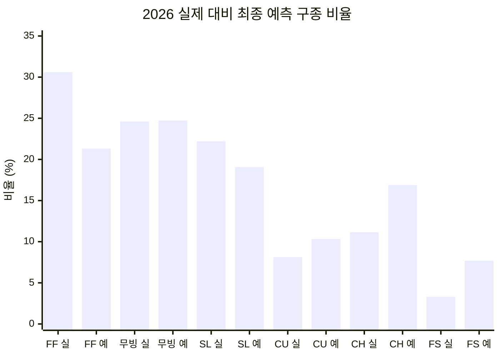

# V5 — 첫 2026 동결 홀드아웃 평가

## 1. 스냅샷

- 날짜: 2026-07-27
- 모델 학습 cutoff: 2025-11-01
- 평가 구간: 2026-03-25~2026-07-25
- 평가 표본: 지원 구종 459,530구
- 2026 데이터 사용: 모델·temperature·scale·registry 선택에서 완전 제외

## 2. 변경 사항

2022–2025 데이터만으로 Global, residual, registry를 다시 만들고 2026 raw
shard를 별도 디렉터리에 격리했다. 학습 폴더나 registry에 2026 cutoff가
감지되면 평가가 중단되는 검사를 추가했다. 이미 공개된 2026 이전 투구는 실제
서비스처럼 다음 투구의 point-in-time 상태만 갱신한다.

## 3. 평가 프로토콜

- 최초로 모델 선택에 사용하지 않은 2026을 외부 평가로 사용했다.
- Global 단독과 실제 registry 라우팅 결과를 같은 투구에서 비교했다.
- 2026 결과는 이번 평가 이후 공개 benchmark이며 후속 선택 기준으로 쓰지
  않는다.

## 4. 결과

### 전체 MLB — 459,530구

| 모델 | Accuracy | Top-3 | Macro F1 | Log Loss |
|---|---:|---:|---:|---:|
| Global | 47.62% | 91.90% | 46.47% | 1.1452 |
| Final routed | 47.73% | 91.92% | 46.50% | 1.1437 |

### Registry 범위

| 범위 | 표본 | Global Accuracy | Final Accuracy | 변화 |
|---|---:|---:|---:|---:|
| 98명 registry pool | 90,145 | 44.10% | 44.68% | +0.58%p |
| active/provisional | 28,734 | 44.15% | 45.97% | +1.83%p |

라우팅은 Global 430,796구, active pooled residual 27,796구, provisional
residual 938구였다. 즉 residual이 실제 개입한 비율은 6.25%다.

### 전체 MLB 최종 모델의 클래스별 결과

| 구종군 | 실제 비율 | 예측 비율 | Recall | F1 |
|---|---:|---:|---:|---:|
| 포심 | 30.60% | 21.31% | 39.45% | 46.51% |
| 무빙 패스트볼 | 24.60% | 24.72% | 56.28% | 56.15% |
| 슬라이더 계열 | 22.21% | 19.08% | 42.30% | 45.51% |
| 커브 계열 | 8.13% | 10.33% | 42.08% | 37.07% |
| 체인지업 | 11.14% | 16.88% | 56.73% | 45.11% |
| 스플리터/포크 | 3.31% | 7.69% | 80.80% | 48.64% |

## 5. 해석

residual은 독립 2026에서도 활성 선수 범위의 Accuracy와 Log Loss를
개선했으므로 개인화 구조 자체는 유효하다. 하지만 전체 트래픽의 6.25%에만
개입해 MLB 전체 개선은 0.11%p에 그쳤다.

전역 포심 과대예측은 없다. 오히려 포심을 실제보다 9.29%p 적게 예측하고
체인지업과 스플리터/포크를 각각 5.74%p, 4.38%p 많이 예측했다. 따라서 다음
문제는 “포심 쏠림”이 아니라 클래스별 prior/calibration 오차와 일부 투수의
국소 쏠림이다.

## 6. 한계

- 2026 시즌 전반부만 포함한다.
- 경기 단위 bootstrap 신뢰구간과 월별 drift 지표가 아직 없다.
- 현재 holdout artifact는 선수별 2026 지표를 저장하지 않아 aggregate
  개선 속에 개별 실패가 가려질 수 있다.
- 이 구간을 보고 모델을 수정하면 같은 구간은 다시 독립 holdout이 아니다.

## 7. 근거

- 로컬 holdout artifact:
  `artifacts/runs/20260727T032547104596Z/holdout-2026.json`
- [실험 로그](../docs/EXPERIMENT_LOG.md)
- 구현: [`ml/oyarzabal/holdout.py`](../ml/oyarzabal/holdout.py)
