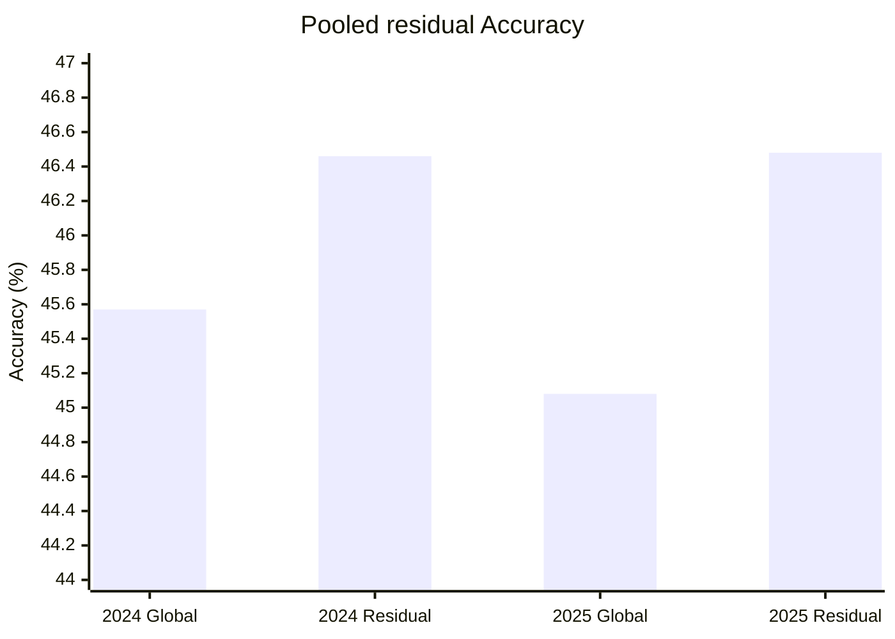

# V4 — pooled contextual residual

## 1. 스냅샷

- 날짜: 2026-07-27
- 학습 데이터: 2022–2025 지원 구종 2,990,491구
- taxonomy: 현재 6종
- 구조: frozen Global logits + pooled multiclass XGBoost correction
- residual: 599 trees, 공통 scale 0.5, 학습 pool 98명
- registry: active 25명, provisional 5명

## 2. 변경 사항

투수별 상수 bias를 카운트 bucket, 타자 손잡이, 직전 구종과 투수 ID를 입력으로
받는 얕은 residual로 교체했다. 2023 OOF로 residual을 만들고 2024에서 scale을
선택한 뒤 2025에서 최종 게이트를 확인했다. Gerrit Cole처럼 2025 표본이 없는
투수는 작은 보정을 시간에 따라 감쇠하는 provisional로 분리했다.

## 3. 평가 프로토콜

- residual 최초 학습: 2023 OOF
- scale 선택: 2024
- 최종 게이트: 2025
- 아래 pool 지표는 98명 모두에게 residual을 적용한 후보 평가다.
- 실제 제품은 그중 registry에서 활성화된 선수에게만 residual을 적용한다.

## 4. 결과

### 2024 scale 선택 — 234,444구

| 모델 | Accuracy | Top-3 | Macro F1 | Log Loss |
|---|---:|---:|---:|---:|
| Global | 45.57% | 90.27% | 43.24% | 1.2087 |
| Residual | 46.46% | 90.61% | 43.07% | 1.1977 |

### 2025 최종 게이트 — 189,721구

| 모델 | Accuracy | Top-3 | Macro F1 | Log Loss |
|---|---:|---:|---:|---:|
| Global | 45.08% | 89.99% | 43.46% | 1.2237 |
| Residual | 46.48% | 90.37% | 43.57% | 1.2054 |

2025에서 Accuracy는 1.40%p, Log Loss는 0.0182 개선됐다. 2024 Macro F1은
0.17%p 하락했지만 당시 허용 범위 0.5%p 안이었다.

### 307구 쇼케이스

| 모델 | Accuracy | Top-3 | Macro F1 | Log Loss |
|---|---:|---:|---:|---:|
| Final residual | 55.37% | 94.79% | 46.72% | 0.9910 |
| Global | 53.75% | 95.44% | 46.10% | 1.0019 |

현재 추적된 최종 JSON의 수치다. 초기 schema v5 생성 직후 실험 로그에 남은
54.07%는 최종 선수 게이트를 반영하기 전 값이므로 이 리포트에서는 Git에 남은
최종 artifact를 기준으로 삼았다.

## 5. 해석

pool 전체와 2025 게이트에서는 residual의 Accuracy와 Log Loss가 모두
개선됐다. 선수별 독립 모델보다 표본 공유가 잘 작동했고, 2026 외부 평가를
진행할 근거를 확보했다.

다만 aggregate 통과가 각 투수의 구종 분포가 안전하다는 뜻은 아니다. 선수별
게이트에는 Log Loss, Accuracy 비열화, 주요 구종 zero recall만 있고 분포 오차와
Macro F1 비열화 조건은 없다.

## 6. 한계

- 2025는 선수 활성화에도 사용됐으므로 이 버전의 완전한 외부 평가는 아니다.
- 모든 active 선수에게 같은 residual scale 0.5를 사용한다.
- active 상한 25명과 파일럿 우선순위가 품질 순위와 노출 순위를 섞는다.
- 307구 쇼케이스는 외부 성능 근거가 아니다.

## 7. 근거

- 로컬 run artifact:
  `artifacts/runs/20260727T032547104596Z/result.json`
- Git artifact: revision `861ff26`,
  `web/public/data/games/775300.json`
- [실험 로그](../docs/EXPERIMENT_LOG.md)
