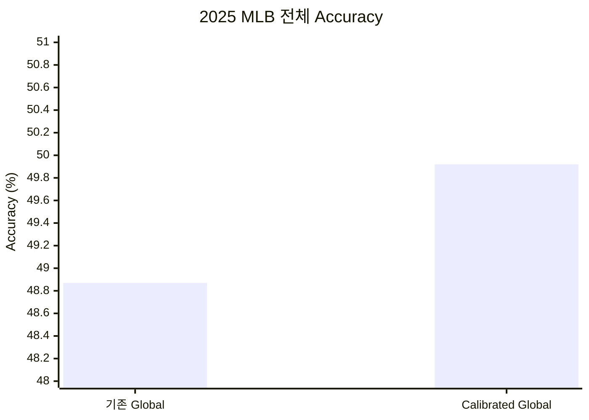
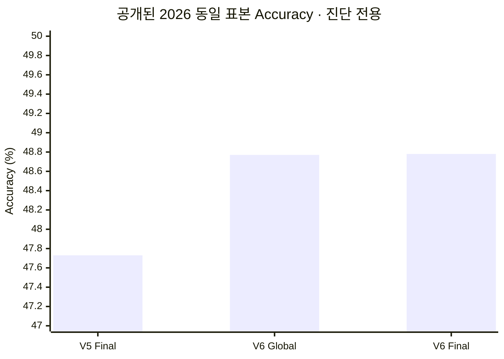

# V6 — Reliability-Gated Residual

> [!IMPORTANT]
> **한 줄 결론:** Global의 클래스별 calibration을 개선하고, residual을
> 투수 신뢰도와 상황 Gate만큼만 적용하도록 단순화했다. 2025 후향 검증은
> 통과했으며 active는 10명이다. 아직 미래 prospective 승격 전인 shadow다.

## 한눈에 보기

- 학습 데이터: 2022–2025 지원 구종 2,990,491구
- Global: `global-sqrt-d6-m8`, temperature 1.0465
- class-wise calibration effective weight: 0.5
- residual pool: 98명
- registry: active 10명, provisional 0명, shadow 88명
- scale: `0.5 × n/(n+1000) × min(P_all, P_recent) × context gate`
- Gate: pitcher/batter ID 없는 binary XGBoost, 973 trees
- 상태: `shadow`

## 무엇이 바뀌었나

V5는 active 선수 모두에게 고정 scale 0.5를 적용했다. V6는 투수별 표본,
전체 기간과 최근 90일 경기 bootstrap 개선 확률, 현재 상황에서 residual이
도움이 될 Gate 확률을 곱한다. 시간 drift용 별도 모델과 residual 크기 모델은
추가하지 않았다. 최종 분포 변화는 JS 0.05와 클래스별 20%p cap으로만 제한한다.

선수 게이트에서는 `majorityPredictionGap`을 제외하고 다음을 함께 확인한다.

- Log Loss, Accuracy, Macro F1, 주요 구종 zero recall
- 클래스별 signed share error와 `maxClassShareError`
- Total Variation Distance
- 평균 예측 확률과 실제 비율의 차이인 `maxClassCalibrationError`
- 선수별·월별 경기 bootstrap

## 평가 설계

- 2023 OOF: residual 최초 학습
- 2024 앞 70%/다음 10%: Gate 학습과 early stopping
- 2024 마지막 20%: V6 선택 구간
- 2025: 후향 검증
- 2026-03-25~07-25: 이미 공개된 benchmark이므로 회귀 진단만 수행
- 2026-07-26 이후: 최소 30일·전체 100,000구·V6 개입 15,000구가 쌓인
  첫 시점에 prospective 승격 평가

## 2025 결과

### Global calibration — MLB 전체 750,581구

| 모델 | Accuracy | Macro F1 | Log Loss |
|---|---:|---:|---:|
| 기존 Global | 48.87% | **47.24%** | 1.1103 |
| Calibrated Global | **49.92%** | 47.11% | **1.0963** |
| 변화 | **+1.05%p** | −0.13%p | **−0.0140** |

Macro F1 하락은 0.5%p 허용 범위 안이며 최대 클래스 calibration 오차는
3.61%p다.

### V6 residual pool — 189,721구

| 모델 | Accuracy | Macro F1 | Log Loss | Max share error | Max calibration error |
|---|---:|---:|---:|---:|---:|
| Calibrated Global | 46.39% | **43.50%** | 1.2077 | 5.85%p | 3.43%p |
| V6 Final | **46.56%** | 43.48% | **1.2049** | **5.76%p** | **3.10%p** |
| 변화 | **+0.18%p** | −0.03%p | **−0.0028** | −0.08%p | −0.34%p |

2024 선택 구간과 2025 모두 Log Loss·Accuracy·분포 게이트를 통과했다.
2025 pool의 effective scale 중앙값은 0.127, p90은 0.212였다.

### Active 선수

| 투수 | Reliability |
|---|---:|
| Hunter Brown | 0.428 |
| JP Sears | 0.418 |
| David Peterson | 0.413 |
| Griffin Canning | 0.407 |
| Chris Flexen | 0.374 |
| Reid Detmers | 0.354 |
| Miles Mikolas | 0.347 |
| Bailey Ober | 0.182 |
| Merrill Kelly | 0.157 |
| Blake Snell | 0.033 |

25명을 채우지 않고 엄격한 2024·2025 선수별 게이트를 통과한 10명만 남겼다.

## 이미 공개된 2026 구간 회귀 진단

아래 결과는 V6를 보고 선택하는 데 사용하지 않았으며, 새로운 독립 승격
근거로 주장하지 않는다.

| 2026-03-25~07-25 전체 459,530구 | Accuracy | Macro F1 | Log Loss |
|---|---:|---:|---:|
| V5 Final | 47.73% | 46.50% | 1.1437 |
| V6 Calibrated Global | 48.77% | **46.80%** | 1.1291 |
| V6 Final | **48.78%** | 46.80% | **1.1290** |

V6가 V5보다 크게 좋아진 부분은 대부분 Global calibration이다. V6 residual이
실제로 개입한 10,344구에서는 Accuracy가 41.35%에서 41.63%로 0.28%p,
Log Loss가 1.3087에서 1.3057로 개선됐다. 전체 적용률은 2.25%다.

이 구간은 기간과 전체 투구 수 조건은 충족하지만 V6 개입이 15,000구에
미달하므로 승격 조건도 충족하지 않는다.

## 307구 역사적 쇼케이스

| 모델 | Accuracy | Macro F1 | Log Loss |
|---|---:|---:|---:|
| Pregame Global | 53.75% | 46.10% | 1.0019 |
| V6 Shadow | **54.07%** | **46.15%** | **0.9996** |

307구 중 90구에 V6 residual이 적용됐다. 이 값은 13명 캐시를 사용한 역사적
제품 쇼케이스이며 MLB-wide 성능 근거가 아니다.

## 판단

V6는 고정 scale과 25명 노출 상한을 제거하면서도 2024·2025 aggregate
게이트를 통과했다. `maxClassShareError`뿐 아니라 확률 calibration과 전체
분포 거리까지 함께 측정해 선수별 국소 쏠림을 더 엄격하게 제한한다.

다만 active 10명의 미래 표본이 아직 15,000구에 못 미친다. 현재 결과는
“구현 및 후향 검증 완료”이지 “V5 대체 승인”이 아니다.

## 재현 근거

- V6 registry: `models/v6/registry.json`
- 전체 학습 run: `artifacts/runs/20260727T070754697905Z/result.json`
- 공개 2026 진단:
  `artifacts/runs/20260727T070750000000Z/holdout-opened-2026-v6.json`
- schema v6 쇼케이스: `web/public/data/games/775300.json`
- 쇼케이스 run: `artifacts/runs/20260727T072157274492Z/result.json`
