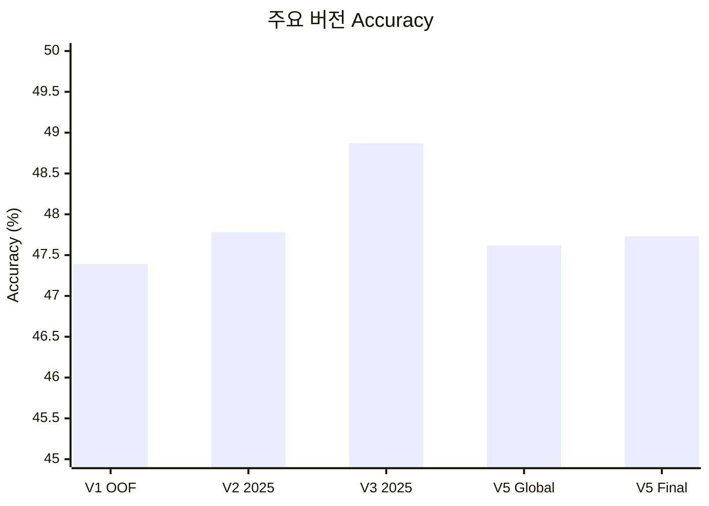

# 모델 성능 리포트

이 디렉터리는 주요 모델 변경 시점의 성능을 같은 형식으로 보존한다. 숫자는
가능하면 run artifact, 그다음 immutable Git artifact, 마지막으로 실험 로그
순서로 채택했다. 평가 표본이나 taxonomy가 다르면 수치가 높더라도 직접적인
버전 우위로 해석하지 않는다.

## 버전 요약

| 버전 | 핵심 변경 | 주 평가 표본 | Accuracy | Top-3 | Macro F1 | Log Loss |
|---|---|---:|---:|---:|---:|---:|
| [V1](2026-07-24-first-mlb-wide.md) | 첫 MLB-wide Global + Specialist | 2024·2025 OOF 1,443,642구 | 47.39% | 91.66% | 45.94% | 1.1436 |
| [V2](2026-07-25-context-personalizer.md) | PA/Game 문맥 + logit-bias personalizer | 2025 725,576구 | 47.78% | 91.64% | 46.20% | 1.1413 |
| [V3](2026-07-25-taxonomy-v4.md) | 현재 6종 taxonomy | 2025 750,581구 | 48.87% | 93.08% | 47.24% | 1.1103 |
| [V4](2026-07-27-pooled-residual.md) | pooled contextual residual | 2025 pool 189,721구 | 45.08% → 46.48% | 89.99% → 90.37% | 43.46% → 43.57% | 1.2237 → 1.2054 |
| [V5](2026-07-27-frozen-holdout.md) | 첫 2026 동결 평가 | 2026 459,530구 | 47.62% → 47.73% | 91.90% → 91.92% | 46.47% → 46.50% | 1.1452 → 1.1437 |

V1과 V2는 포심·싱커·커터·슬라이더·커브·체인지업 taxonomy다. V3 이후는
포심·무빙 패스트볼·슬라이더 계열·커브 계열·체인지업·스플리터/포크
taxonomy이므로 V2→V3의 숫자 차이에는 모델 개선뿐 아니라 label 변경 효과가
섞여 있다.

## Accuracy 막대 비교

평가 표본과 taxonomy가 다른 버전은 순수한 모델 개선량으로 직접 비교하지
않는다. 아래 막대는 기록된 주요 평가의 위치를 빠르게 확인하기 위한 것이다.

초기 13명·7종 MVP와 누수 방지 피처 전환 단계는 완결된 평가 지표가 남아 있지
않아 별도 성능 리포트를 만들지 않았다. 해당 사실과 실패·수정 이력은
[`docs/EXPERIMENT_LOG.md`](../docs/EXPERIMENT_LOG.md)에 보존되어 있다.

## 공통 리포트 형식

각 버전 리포트는 다음 항목을 같은 순서로 기록한다.

1. 스냅샷
2. 변경 사항
3. 평가 프로토콜
4. 결과
5. 해석
6. 한계
7. 근거
