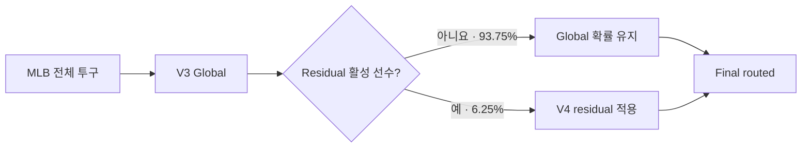

# 모델 성능 리포트

이 디렉터리는 주요 모델 변경 시점의 성능을 같은 형식으로 보존한다. 숫자는
가능하면 run artifact, 그다음 immutable Git artifact, 마지막으로 실험 로그
순서로 채택했다. 평가 표본이나 taxonomy가 다르면 수치가 높더라도 직접적인
버전 우위로 해석하지 않는다.

> [!IMPORTANT]
> **현재 결론:** V7.2는 현재 taxonomy·계층 decoder·Registry·UI 계약의
> 기본 모델로 `active`다. 이는 V5 대비 통계적 승격이 아니라 제품 세대교체다.
> V5의 30명·28,734구 고정 cohort에서는 Log Loss가 0.0086 나빴으므로
> prospective 사후 성능 인증은 계속한다. 연구 기준선은 V8.4이며, V8.5는
> `research-passed / prospective-pending` 후보다. V9-A는 안전 게이트를
> 통과했지만 실용적 최소 효과에는 못 미쳐 `shadow-only`로 보존한다.

V7의 실제 Registry와 계층형 지표 결과는
[V7 리포트](2026-07-27-v7-hierarchical-incremental.md)에 정리했다.
독립 승격 절차와 현재 수집 상태는
[V7 prospective 동결 리포트](2026-07-28-v7-prospective-freeze.md)에
정리했다.
[V7.2 Residual 튜닝 리포트](2026-07-28-v7.2-residual-tuning.md)는
누수 없는 OOF 탐색, 선수별 안전성, 공개 2026 회귀 진단을 함께 기록한다.
[V7.3 tier scale 실험](2026-07-28-v7.3-tier-scale-test.md)은 같은 모델에서
full·limited 배율만 3배·4배로 높인 공개 2026 진단 결과다.
[V7.4 동일 tier scale 실험](2026-07-28-v7.4-equal-tier-scale-test.md)은
full 배율도 4로 맞춘 추가 stress test다.
[V7.5 극단적 Residual 실험](2026-07-28-v7.5-extreme-residual-test.md)은
scale과 확률 안전 cap을 크게 열어 tier별 한계를 확인한다.
[V8 Sequence Expert](2026-07-28-v8-sequence.md)는 최근 16구 Transformer의
증분 신호와 Macro F1 실패를 기록한다.
[V8.1 Balanced Sequence](2026-07-28-v8.1-balanced-sequence.md)는
point-in-time 레퍼토리로 Macro F1을 안전 범위까지 회복한 결과다.
[V8.3 Robust Sequence](2026-07-28-v8.3-robust-sequence.md)는 물리·포수
문맥을 추가했지만 분포 안전 게이트에서 기각된 실험이다.
[V8.4 Distribution-Safe Sequence](2026-07-28-v8.4-distribution-safe-sequence.md)는
분포 안전 objective와 3-seed ensemble로 2024·2025를 통과한 연구 기준선이다.
[V8.4 2026 Temporal 평가](2026-07-29-v8.4-2026-holdout.md)는 2025까지
재학습한 고정 후보의 historical regression 결과다.
[V8.5 Sequence-adjusted Personalizer](2026-07-29-v8.5-sequence-personalizer.md)는
V8.4 위에서 개인화를 다시 학습한 prospective-pending 후보를 기록한다.
[V9-A Game-State Expert](2026-07-29-v9a-game-state.md)는 현재 경기의 최근
구종 mix·마지막 사용 거리와 당일 구위 drift를 분리 검증한 결과이며,
2025까지 재학습한 동일 2026 표본의 V8.5 직접 비교도 포함한다.

## 모델 진화 흐름

```mermaid
flowchart TD
    V1["V1 · MLB-wide 기준선<br/>독립 Specialist 0명"]
    V2["V2 · PA/Game 문맥<br/>상수 bias personalizer 0명"]
    V3["V3 · 현재 6종 taxonomy<br/>전역 포심 쏠림 해소"]
    V4["V4 · pooled residual<br/>active 25명 + provisional 5명"]
    V5["V5 · V4 구조의 2026 외부 검증<br/>전체 +0.11%p · 적용 범위 +1.83%p"]
    V6["V6 · Reliability Gate<br/>고정 cohort에서 V5 열세 · shadow"]
    V7["V7 · 계층 decoder + 증분 Registry<br/>full 4 · limited 43 · shadow 51"]
    V72["V7.2 · reliability/Gate 확대<br/>full 3 · limited 42 · shadow 53"]
    V73["V7.3 · tier scale stress test<br/>full ×3 · limited ×4"]
    V74["V7.4 · equal tier scale<br/>full ×4 · limited ×4"]
    V75["V7.5 · extreme residual<br/>full/limited ×6.372873 · cap 4"]
    V8["V8 · Transformer Sequence Expert<br/>증분 신호 · Macro F1 실패"]
    V81["V8.1 · repertoire-balanced sequence<br/>안전 범위 회복"]
    V83["V8.3 · physical/catcher context<br/>분포 붕괴 · 기각"]
    V84["V8.4 · distribution-safe sequence<br/>2024·2025 통과"]
    V85["V8.5 · sequence-adjusted personalizer<br/>research-passed · prospective-pending"]
    V9A["V9-A · current game-state expert<br/>안전 통과 · shadow-only"]
    V1 --> V2 --> V3 --> V4 --> V5 --> V6 --> V7 --> V72 --> V73 --> V74 --> V75 --> V8 --> V81 --> V83 --> V84 --> V85 --> V9A
```

## 버전 요약

| 버전 | 핵심 변경 | 주 평가 표본 | Accuracy | Macro F1 | Log Loss | 판정 |
|---|---|---:|---:|---:|---:|---|
| [V1](2026-07-24-first-mlb-wide.md) | 첫 MLB-wide Global | 2024·2025 OOF 1,443,642구 | 47.39% | 45.94% | 1.1436 | 기준선 |
| [V2](2026-07-25-context-personalizer.md) | PA/Game 문맥 + logit bias | 2025 725,576구 | 47.78% | 46.20% | 1.1413 | 개인화 실패 |
| [V3](2026-07-25-taxonomy-v4.md) | 현재 6종 taxonomy | 2025 750,581구 | 48.87% | 47.24% | 1.1103 | taxonomy 기준선 |
| [V4](2026-07-27-pooled-residual.md) | pooled residual | 2025 **98명 내부 pool** 189,721구 | 45.08% → **46.48%** | 43.46% → **43.57%** | 1.2237 → **1.2054** | 전체 MLB 점수 아님 |
| [V5](2026-07-27-frozen-holdout.md) | **V4 구조 외부 검증** | 2026 **MLB 전체 동일 표본** 459,530구 | 47.62% → **47.73%** | 46.47% → **46.50%** | 1.1452 → **1.1437** | 제품 단위 개선 확인 |
| [V6](2026-07-27-v6-reliability-gate.md) | Calibration + reliability gate | 2026 **V5 고정 30명** 28,734구 | **45.14%** → 44.99% | 39.23% → **39.31%** | **1.2422** → 1.2475 | 새 decoder 재평가 · Shadow |
| [V7](2026-07-27-v7-hierarchical-incremental.md) | 계층 decoder + 증분 Registry | 2026 **V5 고정 30명** 28,734구 | **45.14%** → 44.53% | 39.23% → **39.77%** | **1.2422** → 1.2515 | Registry 재판정 · Shadow |
| [V7.2](2026-07-28-v7.2-residual-tuning.md) | reliability/Gate 확대 + 공통 안전 배율 | 2026 **V5 고정 30명** 28,734구 | **45.14%** → 44.68% | 39.23% → **39.82%** | **1.2422** → 1.2508 | 현재 taxonomy 기본 모델 · Active |
| [V7.3](2026-07-28-v7.3-tier-scale-test.md) | full ×3 + limited ×4 | 2026 **V5 고정 30명** 28,734구 | **45.14%** → 44.88% | 39.23% → **39.49%** | **1.2422** → 1.2460 | 공개 표본 stress test |
| [V7.4](2026-07-28-v7.4-equal-tier-scale-test.md) | full ×4 + limited ×4 | 2026 **V5 고정 30명** 28,734구 | **45.14%** → 44.88% | 39.23% → **39.49%** | **1.2422** → 1.2460 | full 증분 stress test |
| [V7.5](2026-07-28-v7.5-extreme-residual-test.md) | 극단적 scale + cap 해제 | 2026 **V5 고정 30명** 28,734구 | **45.14%** → 44.42% | **39.23%** → 35.16% | **1.2422** → 1.2536 | limited 과보정 · 기각 |
| [V8](2026-07-28-v8-sequence.md) | 최근 16구 Transformer Expert | 2025 OOF 750,581구 | 48.60% → 49.45% | **46.60%** → 45.85% | 1.1103 → **1.0981** | Macro F1 게이트 실패 · blend 0 |
| [V8.1](2026-07-28-v8.1-balanced-sequence.md) | point-in-time 레퍼토리 + 균형 실험 | 2025 OOF 750,581구 | 48.60% → **49.57%** | **46.60%** → 46.48% | 1.1103 → **1.0962** | accepted trade-off · 연구 후보 |
| [V8.3](2026-07-28-v8.3-robust-sequence.md) | Global-conditioned physical/catcher residual | 2024 OOF 740,320구 | 48.94% | **46.27%** → 42.61% | 1.0937 → **1.0723** | Macro F1·TVD 실패 · 기각 |
| [V8.4](2026-07-28-v8.4-distribution-safe-sequence.md) | 분포 안전 objective + 3-seed ensemble | 2025 OOF 750,581구 | 48.60% → **48.99%** | 46.60% → **46.59%** | 1.1103 → **1.1023** | 연구 게이트 통과 |
| [V8.4 2026](2026-07-29-v8.4-2026-holdout.md) | 2025까지 전체 재학습 | 2026 historical 467,300구 | 47.46% → **47.91%** | 45.60% → **45.69%** | 1.1467 → **1.1377** | temporal regression 통과 |
| [V8.5](2026-07-29-v8.5-sequence-personalizer.md) | V8.4 위 pooled Personalizer 재학습 | 2025 OOF 750,581구 | 48.99% → **49.00%** | **46.59%** → 46.59% | 1.1023 → **1.1021** | research-passed · prospective-pending |
| [V9-A](2026-07-29-v9a-game-state.md) | 최근 20구 game mix + last-used Expert | 2025 OOF 750,581구 | 48.99% → **49.19%** | **46.59%** → 46.54% | 1.1023 → **1.0989** | 안전 통과 · 실용 기준 미달 · Shadow |
| [V9-A 2026](2026-07-29-v9a-game-state.md) | 2025까지 재학습 · V8.5 공통 표본 비교 | 2026 historical 467,300구 | 47.91% → **48.07%** | **45.69%** → 45.62% | 1.1377 → **1.1341** | V8.5보다 Exact +0.16%p · 진단 전용 |

V8.2는 독립적으로 동결된 모델·리포트가 없어 표에 넣지 않았다. 번호는 실험
브랜치의 중간 반복을 보존한 것이며, 결과가 남은 다음 정식 실험은 V8.3이다.

V1과 V2는 포심·싱커·커터·슬라이더·커브·체인지업 taxonomy다. V3 이후는
포심·무빙 패스트볼·슬라이더 계열·커브 계열·체인지업·스플리터/포크
taxonomy이므로 V2→V3의 숫자 차이에는 모델 개선뿐 아니라 label 변경 효과가
섞여 있다.

V1~V5 링크의 숫자는 당시 공식 판정 규칙을 보존한 역사 기록이다. 현재 제품
비교는 아래처럼 V5·V6·V7 확률에 동일한 `family-sum-then-child` decoder를
적용한다.

| 2026 MLB 전체 459,530구 | Exact | Family | Hierarchical | Macro F1 | Log Loss |
|---|---:|---:|---:|---:|---:|
| V5 | 47.58% | 58.16% | 52.87% | **45.86%** | 1.1437 |
| V6 | **48.28%** | **59.27%** | **53.78%** | 45.49% | **1.1290** |
| V7 | 47.94% | 58.71% | 53.33% | 45.76% | 1.1359 |

| 고정 30명 28,734구 | Exact | Family | Hierarchical | Macro F1 | Log Loss |
|---|---:|---:|---:|---:|---:|
| V5 | **45.14%** | **58.61%** | **51.88%** | 39.23% | **1.2422** |
| V6 | 44.99% | 58.40% | 51.69% | 39.31% | 1.2475 |
| V7 | 44.53% | 57.83% | 51.18% | **39.77%** | 1.2515 |

## V3 구조와 V4 구조의 제품 단위 비교

V4는 V3 Global을 대체하지 않는다. 전체 투구를 먼저 같은 Global로 예측하고,
registry에서 활성화된 선수에게만 residual correction을 적용한다.

따라서 제품 개선 여부는 서로 다른 V3·V4 리포트의 대표 숫자가 아니라, 같은
투구에 Global 단독과 Final routed를 함께 적용해 판단해야 한다. 이 조건을
충족한 첫 평가는 2026 동결 holdout이다.

| 2026 MLB 전체 459,530구 | Accuracy | Macro F1 | Log Loss |
|---|---:|---:|---:|
| Global 단독 — V3 구조 | 47.62% | 46.47% | 1.1452 |
| Final routed — V4 구조 | **47.73%** | **46.50%** | **1.1437** |
| 변화 | **+0.11%p** | +0.03%p | **−0.0015** |

active/provisional 28,734구에서는 Accuracy가 44.15%에서 45.97%로
1.83%p 개선됐다. 전체 개선 폭은 대략 `6.25% × 1.83%p = 0.11%p`로,
residual 적용 범위가 작은 효과를 그대로 반영한다.

## 비교할 때 지켜야 할 경계

| 비교 | 직접 비교 | 이유 |
|---|---|---|
| V1 ↔ V2 | 제한적 | taxonomy는 같지만 평가 표본이 다름 |
| V2 ↔ V3 | 불가 | taxonomy가 변경됨 |
| V3 리포트 48.87% ↔ V4 리포트 46.48% | 불가 | MLB 전체와 98명 pool로 평가 대상이 다름 |
| V3 Global 구조 ↔ V4 Final routed 구조 | 가능 | 같은 2026 전체 표본의 V5 외부 평가 사용 |
| V4 Global ↔ Residual | 가능 | 같은 투구에 두 모델을 적용 |
| V5 Global ↔ Final | 가능 | 같은 2026 동결 holdout에 적용 |
| V5 ↔ V6/V7 공개 2026 | 성능 회귀 진단만 | 동일 decoder·고정 cohort지만 이미 결과를 열어 독립 승격 근거가 아님 |
| V5 ↔ V6/V7 2026-07-26 이후 | 가능 | 사전 고정한 prospective 조건 충족 후 첫 평가만 사용 |
| V8 ↔ V8.1 ↔ V8.4 2025 | 가능 | 같은 2025 OOF 750,581구와 같은 Global 기준선 |
| V8.4 ↔ V8.5 2025 | 가능 | 같은 행의 V8.4 OOF를 V8.5 base로 사용 |
| V8.4 ↔ V9-A 2025 | 가능 | 같은 행의 V8.4 OOF와 고정된 2024 선택 규칙 사용 |
| V8.4/V8.5 2026 | 회귀 진단만 | 이미 관찰된 historical 구간으로 선택·승격 근거가 아님 |

## 통일된 평가 표본

앞으로 버전 간 비교는 다음 두 표본만 공식 비교에 사용한다.

- 전체 제품 성능: 같은 기간의 MLB 전체 지원 구종
- 개인화 성능: V5 active·provisional 30명을 고정한
  `v5-enabled-pitchers-v1`
- 공식 선택 규칙: `family-sum-then-child`

각 모델의 registry pool이나 active 선수만 추린 결과는 운영 진단일 뿐 버전
우위를 판단하지 않는다. 모든 holdout 결과에는 exact row fingerprint를
기록하며, 2026-03-25~07-25 고정 개인화 표본은 28,734구,
`a2d7de0347b98e9cac05fe1ee22eedc1eab33aa5430e770089755f8945198232`다.

초기 13명·7종 MVP와 누수 방지 피처 전환 단계는 완결된 평가 지표가 남아 있지
않아 별도 성능 리포트를 만들지 않았다. 해당 사실과 실패·수정 이력은
[`docs/EXPERIMENT_LOG.md`](../docs/EXPERIMENT_LOG.md)에 보존되어 있다.

## 리포트 읽는 순서

각 버전 리포트는 다음 항목을 같은 순서로 기록한다.

1. 한눈에 보기
2. 무엇이 바뀌었나
3. 평가 설계
4. 성능 결과
5. 판단
6. 비교 시 주의사항
7. 재현 근거
