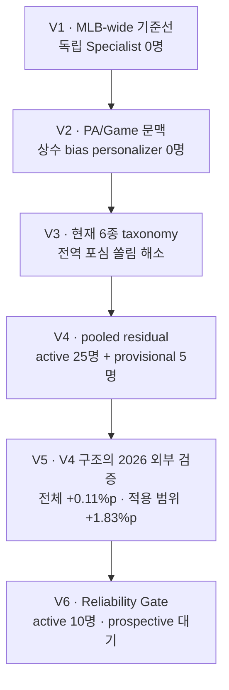
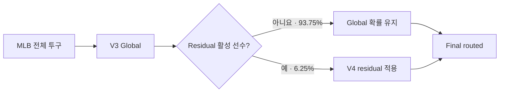

# 모델 성능 리포트

이 디렉터리는 주요 모델 변경 시점의 성능을 같은 형식으로 보존한다. 숫자는
가능하면 run artifact, 그다음 immutable Git artifact, 마지막으로 실험 로그
순서로 채택했다. 평가 표본이나 taxonomy가 다르면 수치가 높더라도 직접적인
버전 우위로 해석하지 않는다.

> [!IMPORTANT]
> **현재 결론:** V6는 class-wise calibration과 reliability-gated residual을
> 적용해 2025 후향 검증을 통과했다. 엄격한 게이트를 통과한 active는
> 10명이며 아직 미래 prospective 승격 전인 shadow다.

## 모델 진화 흐름

## 버전 요약

| 버전 | 핵심 변경 | 주 평가 표본 | Accuracy | Macro F1 | Log Loss | 판정 |
|---|---|---:|---:|---:|---:|---|
| [V1](2026-07-24-first-mlb-wide.md) | 첫 MLB-wide Global | 2024·2025 OOF 1,443,642구 | 47.39% | 45.94% | 1.1436 | 기준선 |
| [V2](2026-07-25-context-personalizer.md) | PA/Game 문맥 + logit bias | 2025 725,576구 | 47.78% | 46.20% | 1.1413 | 개인화 실패 |
| [V3](2026-07-25-taxonomy-v4.md) | 현재 6종 taxonomy | 2025 750,581구 | 48.87% | 47.24% | 1.1103 | taxonomy 기준선 |
| [V4](2026-07-27-pooled-residual.md) | pooled residual | 2025 **98명 내부 pool** 189,721구 | 45.08% → **46.48%** | 43.46% → **43.57%** | 1.2237 → **1.2054** | 전체 MLB 점수 아님 |
| [V5](2026-07-27-frozen-holdout.md) | **V4 구조 외부 검증** | 2026 **MLB 전체 동일 표본** 459,530구 | 47.62% → **47.73%** | 46.47% → **46.50%** | 1.1452 → **1.1437** | 제품 단위 개선 확인 |
| [V6](2026-07-27-v6-reliability-gate.md) | Calibration + reliability gate | 2025 residual pool 189,721구 | 46.39% → **46.56%** | 43.50% → 43.48% | 1.2077 → **1.2049** | Shadow · 미래 승격 대기 |

V1과 V2는 포심·싱커·커터·슬라이더·커브·체인지업 taxonomy다. V3 이후는
포심·무빙 패스트볼·슬라이더 계열·커브 계열·체인지업·스플리터/포크
taxonomy이므로 V2→V3의 숫자 차이에는 모델 개선뿐 아니라 label 변경 효과가
섞여 있다.

## V3 구조와 V4 구조의 제품 단위 비교

V4는 V3 Global을 대체하지 않는다. 전체 투구를 먼저 같은 Global로 예측하고,
registry에서 활성화된 선수에게만 residual correction을 적용한다.

따라서 제품 개선 여부는 서로 다른 V3·V4 리포트의 대표 숫자가 아니라, 같은
투구에 Global 단독과 Final routed를 함께 적용해 판단해야 한다. 이 조건을
충족한 첫 평가는 2026 동결 holdout이다.

| 2026 MLB 전체 459,530구 | Accuracy | Macro F1 | Log Loss |
|---|---:|---:|---:|
| Global 단독 — V3 구조 | 47.62% | 46.47% | 1.1452 |
| Final routed — V4 구조 | **47.73%** | **46.50%** | **1.1437** |
| 변화 | **+0.11%p** | +0.03%p | **−0.0015** |

active/provisional 28,734구에서는 Accuracy가 44.15%에서 45.97%로
1.83%p 개선됐다. 전체 개선 폭은 대략 `6.25% × 1.83%p = 0.11%p`로,
residual 적용 범위가 작은 효과를 그대로 반영한다.

## 비교할 때 지켜야 할 경계

| 비교 | 직접 비교 | 이유 |
|---|---|---|
| V1 ↔ V2 | 제한적 | taxonomy는 같지만 평가 표본이 다름 |
| V2 ↔ V3 | 불가 | taxonomy가 변경됨 |
| V3 리포트 48.87% ↔ V4 리포트 46.48% | 불가 | MLB 전체와 98명 pool로 평가 대상이 다름 |
| V3 Global 구조 ↔ V4 Final routed 구조 | 가능 | 같은 2026 전체 표본의 V5 외부 평가 사용 |
| V4 Global ↔ Residual | 가능 | 같은 투구에 두 모델을 적용 |
| V5 Global ↔ Final | 가능 | 같은 2026 동결 holdout에 적용 |
| V5 ↔ V6 공개 2026 | 회귀 진단만 | V6 설계 전에 이미 결과를 열어 독립 승격 근거가 아님 |
| V5 ↔ V6 2026-07-26 이후 | 가능 | 사전 고정한 prospective 조건 충족 후 첫 평가만 사용 |

초기 13명·7종 MVP와 누수 방지 피처 전환 단계는 완결된 평가 지표가 남아 있지
않아 별도 성능 리포트를 만들지 않았다. 해당 사실과 실패·수정 이력은
[`docs/EXPERIMENT_LOG.md`](../docs/EXPERIMENT_LOG.md)에 보존되어 있다.

## 리포트 읽는 순서

각 버전 리포트는 다음 항목을 같은 순서로 기록한다.

1. 한눈에 보기
2. 무엇이 바뀌었나
3. 평가 설계
4. 성능 결과
5. 판단
6. 비교 시 주의사항
7. 재현 근거
